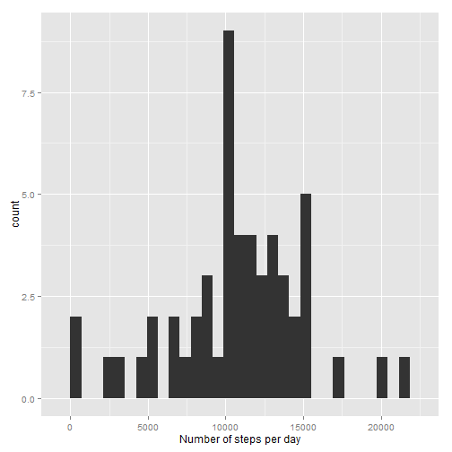
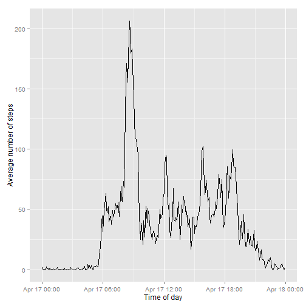
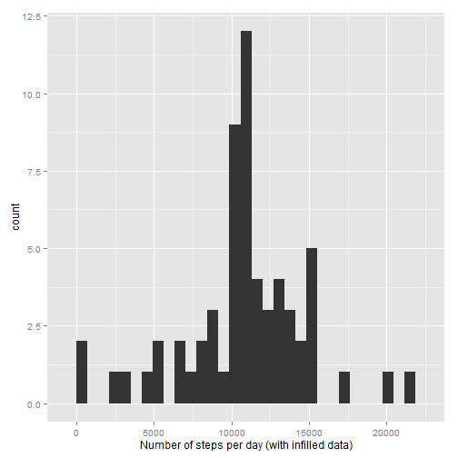
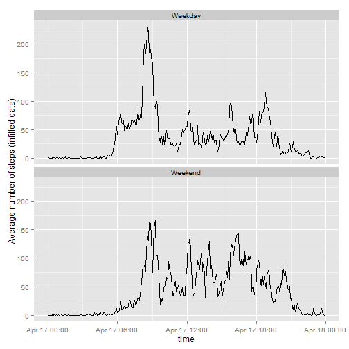

## Loading and preprocessing the data

First, let's load the data and clean it up a little:


```r
data_URL <- 'https://d396qusza40orc.cloudfront.net/repdata%2Fdata%2Factivity.zip'

if (!(file.exists('activity.zip'))){
  download.file(data_URL, 'activity.zip', mode='wb')
}
if (!(file.exists('activity.csv'))){
  files <- unzip('activity.zip',list=T)
  unzip('activity.zip')
}

activity <- read.csv('activity.csv',header=T,sep=',',quote='"')


## Load packages...

library(lubridate)
library(ggplot2)
library(reshape)

conv_interval_to_time <- function(interval){
  strptime(paste0(floor(interval/100),":",
                  interval%%100),format="%H:%M")
}

time_format <- function(time){
  format(time, "%H:%M")
}

## Reformat time/date data
activity$date <- ymd(activity$date) # from lubridate
activity$time <- conv_interval_to_time(activity$interval)

activity.missing <- activity[is.na(activity[,1]),]
activity.nonmissing <- activity[!is.na(activity[,1]),]
```

## What is mean total number of steps taken per day?


```r
daily.steps <- tapply(activity.nonmissing$steps,
                      activity.nonmissing$date,
                      'sum',
                      rm.na=T)
```

Ignoring missing data, the mean number of steps is


```r
print(mean(daily.steps))
```

```
## [1] 10767.19
```

And the median is


```r
print(median(daily.steps))
```

```
## [1] 10766
```

```r
qplot(daily.steps,xlab='Number of steps per day')
```

```
## stat_bin: binwidth defaulted to range/30. Use 'binwidth = x' to adjust this.
```

 


## What is the average daily activity pattern?

Ignoring missing data again, calculate the average number of steps taken across each day for each time interval.


```r
activity.pattern <- tapply(activity.nonmissing$steps, 
                           activity.nonmissing$interval, 
                           'mean')
activity.pattern <- data.frame(time=conv_interval_to_time(as.numeric(row.names(activity.pattern))),
                               interval=row.names(activity.pattern),
                               av.steps=activity.pattern)


ggplot(data=activity.pattern,
       aes(x=time,y=av.steps))+
  ylab("Average number of steps") + 
  xlab('Time of day') +
  geom_line() 
```

 

The time at which the most number of steps on average taken is 

```r
print(time_format(activity.pattern[which(activity.pattern$av.steps == 
                                           max(activity.pattern$av.steps)),
                                    1]))
```

```
## [1] "08:35"
```

## Imputing missing values

The number of rows in the data set is 

```r
nrows <- dim(activity)[1]
print(nrows)
```

```
## [1] 17568
```
And the number of rows with missing data is

```r
nmissing <- dim(activity.missing)[1]
print(nmissing)
```

```
## [1] 2304
```

To impute missing values, just use the mean number of steps taken at a particular time of day from the daily activity pattern.


```r
# Infill from average steps (i.e. from the activity.pattern data frame)
activity.infilled <- merge(activity.missing,
                           activity.pattern,
                           by="interval")

# And make the data frame nice:
activity.infilled <- data.frame(steps=activity.infilled$av.steps,
                                date=activity.infilled$date,
                                interval=activity.infilled$interval,
                                time=activity.infilled$time.x,
                                infilled=1)
# row bind with the nonmissing data:
temp <- data.frame(steps=activity.nonmissing$steps,
                  date=activity.nonmissing$date,
                  interval=activity.nonmissing$interval,
                  time=activity.nonmissing$time,
                  infilled=0)
activity.infilled <- rbind(activity.infilled, 
                            temp)

# Calculate daily number of steps on the infilled data
daily.steps.infilled <- tapply(activity.infilled$steps,
                               activity.infilled$date,
                               'sum')
```

Now, the mean number of steps per day using the infilled data is


```r
print(mean(daily.steps.infilled))
```

```
## [1] 10766.19
```

And the median number of steps using infilled data is


```r
print(median(daily.steps.infilled))
```

```
## [1] 10766.19
```

which is not substantially different from the original data set. But the standard deviation is much lower:


```r
print(sd(daily.steps))
```

```
## [1] 4269.18
```

```r
print(sd(daily.steps.infilled))
```

```
## [1] 3974.391
```

Although this is not readily apparent in the histogram of the infilled data:


```r
qplot(daily.steps.infilled,
      xlab='Number of steps per day (with infilled data)')
```

```
## stat_bin: binwidth defaulted to range/30. Use 'binwidth = x' to adjust this.
```

 


## Are there differences in activity patterns between weekdays and weekends?


```r
## Week day analysis

# include a weekday column and relabel to Weekday/Weekend
activity.infilled <- cbind(activity.infilled,
                            weekdays(activity.infilled$date))
colnames(activity.infilled)[6] = 'Day'
activity.infilled$Day <- factor(activity.infilled$Day,
                                levels=c(levels(activity.infilled$Day),
                                         'Weekday','Weekend'))
activity.infilled[activity.infilled$Day %in% c('Saturday',
                                                 'Sunday'),
                   'Day']='Weekend'
activity.infilled[activity.infilled$Day %in% c('Monday',
                                                 'Tuesday',
                                                 'Wednesday',
                                                 'Thursday',
                                                 'Friday'),
                   'Day']='Weekday'
# Remove unused levels
activity.infilled$Day=factor(activity.infilled$Day)

# Calculate the activity pattern from this
activity.pattern.infilled <- data.frame(tapply(activity.infilled$steps, 
                                        list(activity.infilled$interval,
                                             activity.infilled$Day),
                                        'mean'))
activity.pattern.infilled$interval = as.numeric(row.names(activity.pattern.infilled))

# melt the data frame to pass to qplot
melted<-melt(activity.pattern.infilled,
             id.var='interval',
             measure.vars=c('Weekday','Weekend'),
             variable_name='Day')
melted$time = conv_interval_to_time(as.numeric(melted$interval))
qplot(time,value,data=melted,geom='line',
      ylab='Average number of steps (infilled data)') + 
  facet_wrap(~Day,ncol=1)
```

 

Like most of us, our test subject enjoys a sleep-in on the weekend, and stays up a bit later compared to a weekday.
